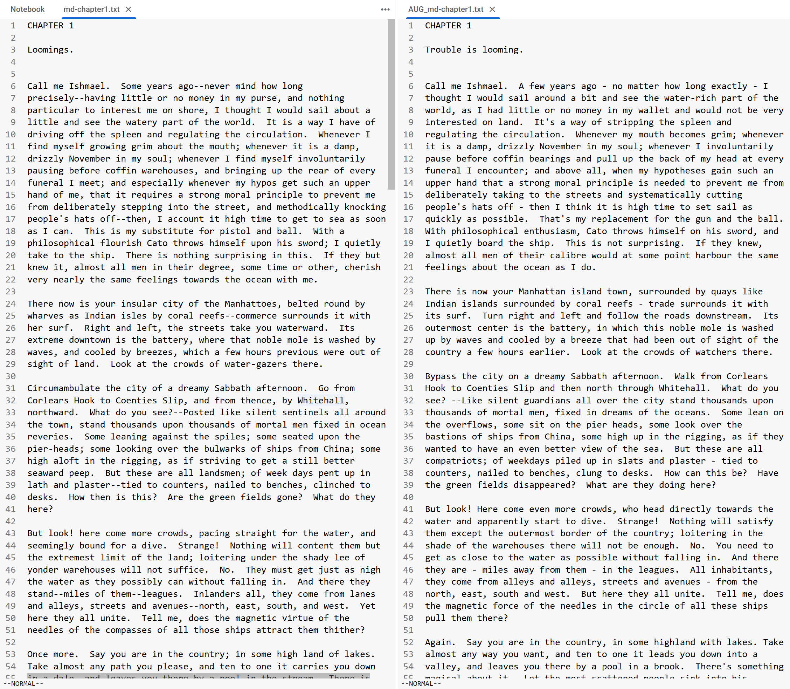
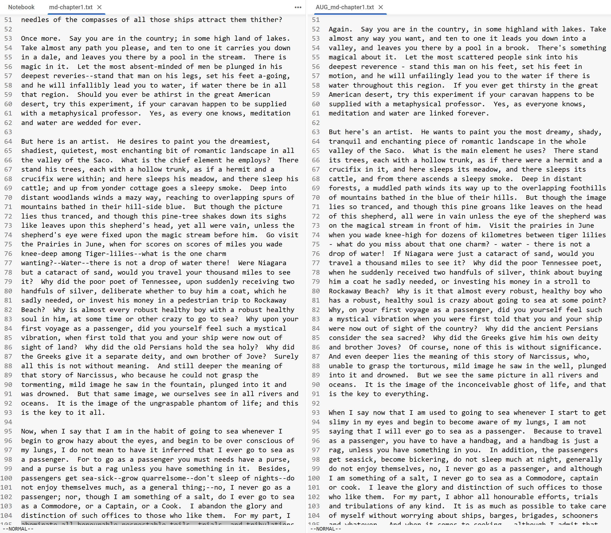
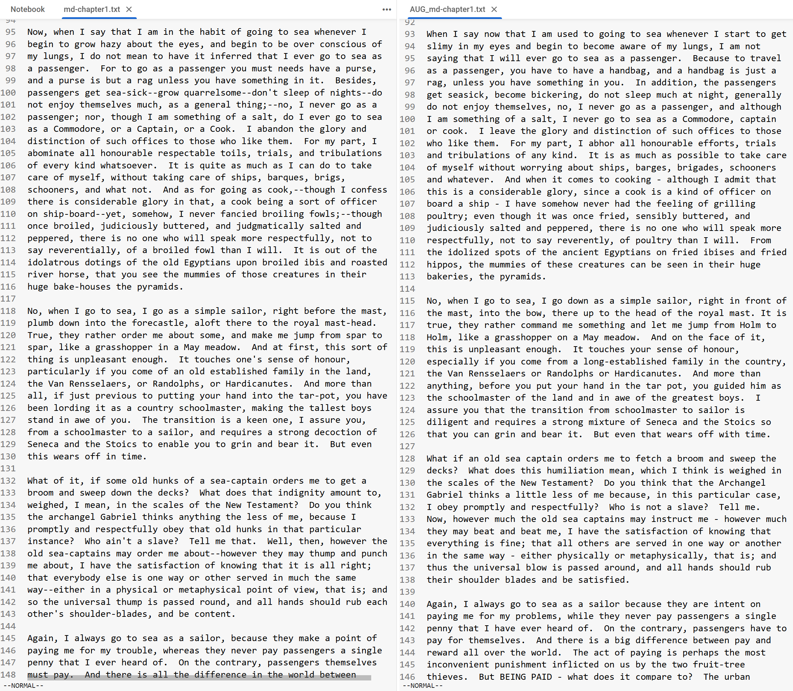
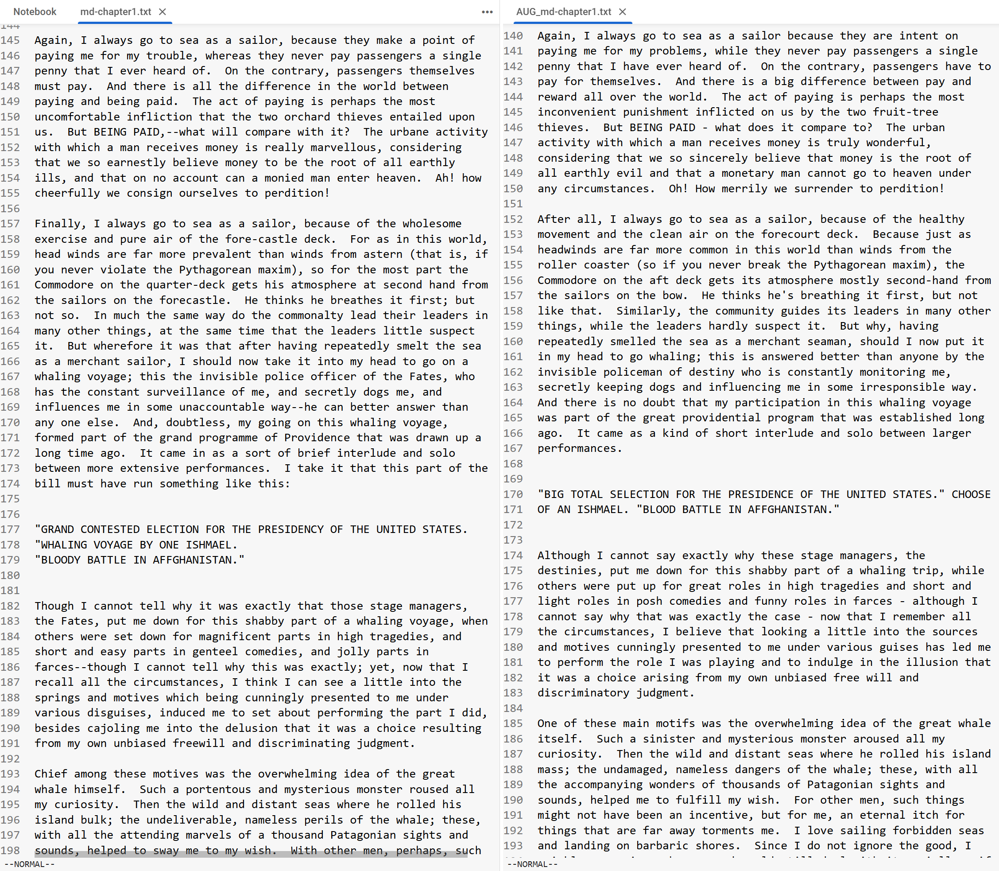
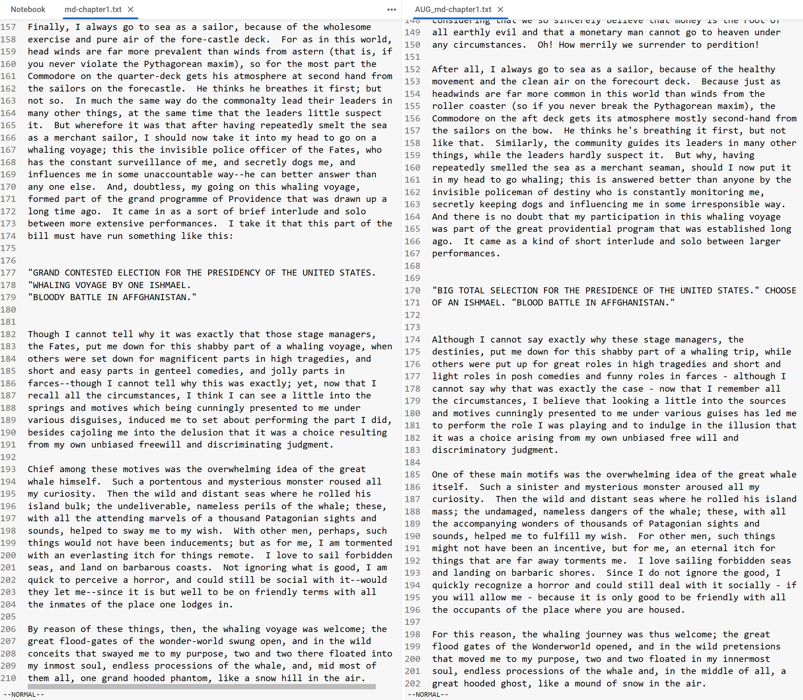

# TextAugmentor: Text Augmentation using Back-Translation

This repository contains a Python project that uses the NLPAug library and a back-translation (round-trip translation) technique to augment text datasets. The goal of text augmentation is to increase the quantity and variety of training data, making it more diverse and effective for natural language processing (NLP) tasks. This repository processes text files, creating augmented versions that can be used to improve model performance in NLP applications like chatbot training or text classification.

## Overview of Text Augmentation Techniques

Text augmentation is a method used to expand or modify existing text data to enhance the quality and diversity of training data for NLP tasks. Common text augmentation techniques include:

- **Synonym Replacement**: Replacing words with their synonyms.
- **Random Insertion**: Inserting random synonyms of words into the text.
- **Random Deletion**: Deleting random words from the text.
- **Random Swap**: Swapping the position of random words in the text.
- **Back-Translation**: Translating the text to another language and back to the original language.

## Applications of Text Augmentation

Text augmentation can be used in many NLP tasks, such as:

- Text classification
- Sentiment analysis
- Named entity recognition
- Machine translation
- Chatbot training
- Question-answering systems

## Back-Translation Augmenter

This project employs the back-translation augmentation technique, which translates text to another language and then back to the original language. This process can introduce variations while retaining the original meaning, which helps create more diverse training data. The project uses the NLPAug library to perform back-translation on the input text files.

### Language Models Used

- **Translation Models**: `facebook/wmt19-en-de` (English to German) and `facebook/wmt19-de-en` (German to English) are used for back-translation.

## Directory Structure

```
.
|-- LICENSE
|-- README.md
|-- data
|   |-- md-chapter1.txt
|   `-- md-chapter2.txt
|-- output
|   |-- AUG_md-chapter1.txt
|   `-- AUG_md-chapter2.txt
|-- scripts
|   |-- python_39_install.sh
|   `-- setup.sh
|-- requirements.txt
|-- src
    `-- main.py
```

- **data/**: Contains the text files to be augmented.
- **output/**: Contains the augmented text files.
- **scripts/**: Contains setup scripts for installing necessary packages.
- **src/**: Contains the main Python script (`main.py`) that performs text augmentation.

## Usage

1. Clone this repository:

   ```bash
   git clone https://github.com/sminerport/TextAugmentor.git
   ```

2. Change to the project directory:

   ```bash
   cd TextAugmentor
   ```

3. Install the required dependencies:

   - If running in Google Colab, first execute the installation script:

     ```bash
     ./scripts/python_39_install.sh
     ```

     This installs Python 3.9, the requirements, and the specific version of PyTorch needed.

   - If running locally, ensure you have Python 3.9 installed, then run the `setup.sh` script to install the requirements and the correct PyTorch version:

     ```bash
     ./scripts/setup.sh
     ```

4. Run the Python script:

   ```bash
   python src/main.py
   ```

The script will process each text file in the `data/` directory, performing back-translation, and save the augmented versions in the `output/` folder with an "AUG\_" prefix.

## Key Features of TextAugmentor

- **Paragraph-Level Processing**: Text is split into paragraphs rather than processing line-by-line. This allows more natural augmentations and maintains the document structure.
- **Sentence-Based Augmentation**: Within each paragraph, sentences are extracted and augmented individually, ensuring that grammatical consistency is preserved.
- **Format Preservation**: The original format of the text, such as double spaces between sentences, newlines between paragraphs, and spacing after headers, is preserved as closely as possible in the augmented output. The maximum line length of the original text is also maintained.

## Screenshots of Augmented Text

Below are screenshots of the original text from Moby-Dick and the augmented output, displayed side-by-side to showcase the differences introduced by back-translation.








## Future Enhancements

- **User Interface**: Develop a simple web-based UI to allow users to upload files for augmentation.
- **Customizable Translation Models**: Allow users to choose different translation models for back-translation.
- **Fine-Tuning Options**: Provide configurable settings for different aspects of augmentation, such as specifying languages for back-translation or preserving specific formatting.

## License

This project is licensed under the [MIT License](LICENSE) - see the LICENSE file for details.

## Acknowledgments

- NLPAug library: [https://github.com/makcedward/nlpaug](https://github.com/makcedward/nlpaug)
- Back-translation technique inspired by NLP research